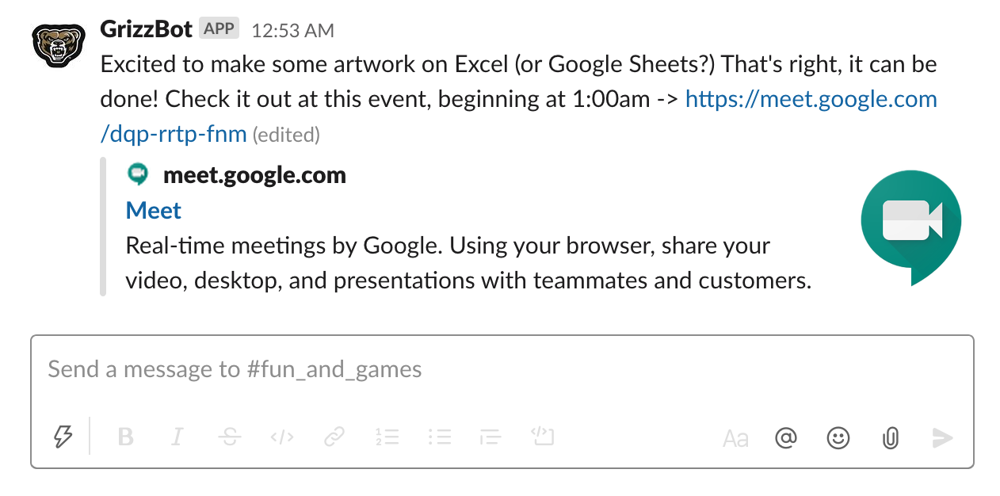

# GrizzBot 🐻
A Slack bot for use in managing the GrizzHacks 5 virtual sponsorship expo and automating tedious tasks and reminders during the event.

# _What can GrizzBot do?_
## Moderate a Virtual Sponsor Expo
With events moved to an entirely virtual environment, GrizzBot is there to help make sure everything runs smoothly for both hackers and sponsors. Simply install GrizzBot into the **Slack** workspace and hackers can type slash commands right in the chat to join the queue to meet one-on-one with sponsors, and have a video meeting link sent directly to them when it's their turn.

 

### Sponsor's Perspective
From the sponsor's point-of-view, using GrizzBot is easy! The sponsor representative will simply:
1. Join the designated video conferencing link provisioned for them
2. Wait for hackers to join the queue for the meeting link (sponsors can check the status of the queue using the `/showqueue` command typed into the Slack chat)
3. When the sponsor is ready to accept new hackers, they can type the `/advancequeue [sponsor-key]`  command into the channel chat, where “sponsor-key” is the secret sponsor password provided to the company’s point of contact This will automatically send the invitation link through Slack to the hacker.

### Hacker's Perspective
From the hacker's point of view, the steps are just as easy:
1. Type in `/joinqueue` to enter the queue to speak with a representative
2. To see where you are at in the queue, you can type `/showqueue`
3. If you decide to leave, you type in `/leavequeue`
When the recruiters are ready, you'll get a message in this channel that you can click on to join the meeting!

 

## Automate Reminder Messages to Keep Hackers Informed
 GrizzBot in Context            |  Automated Meeting Links
:-------------------------:|:-------------------------:
  |   

## Send Encouraging Messages to Keep Hackers Motivated
 

